# MeanShop

MeanShop is simple online shop web appliaction, build with MEAN stack as my university project.
It can be divided into 3 parts:
* Shop application ([Github](https://github.com/thirteendollars/meanshop-shop))
* Administrator panel application ([Github](https://github.com/thirteendollars/meanshop-adminpanel/))
* API server ([Github](https://github.com/thirteendollars/meanshop-api/))

## Shop application

Application provides filtering by category, name, price or price range.
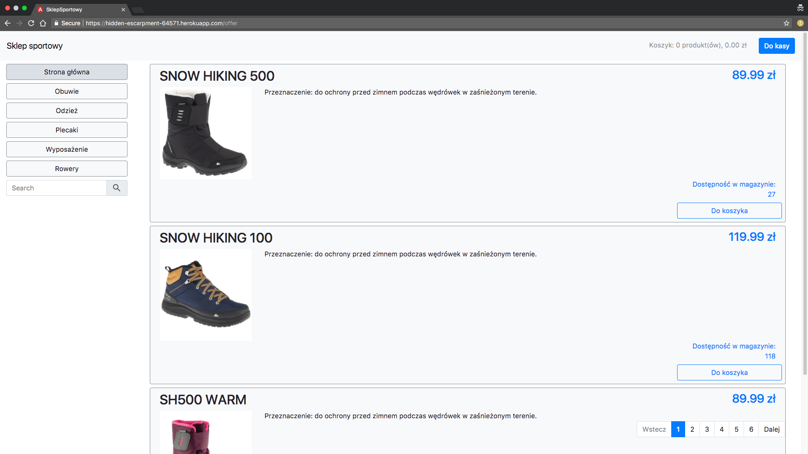
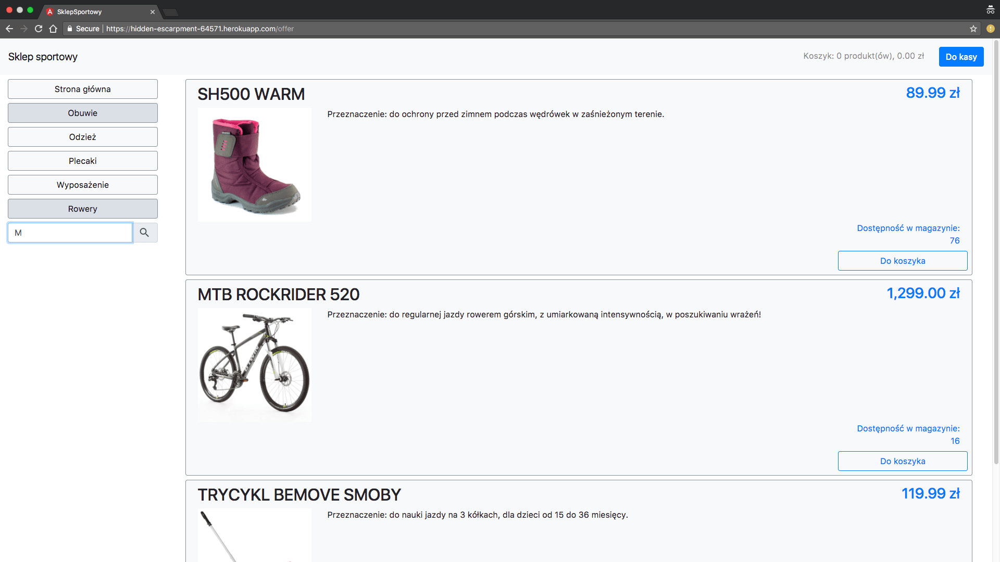

Cart page shows details of your order and allow to modify it whenever you want.
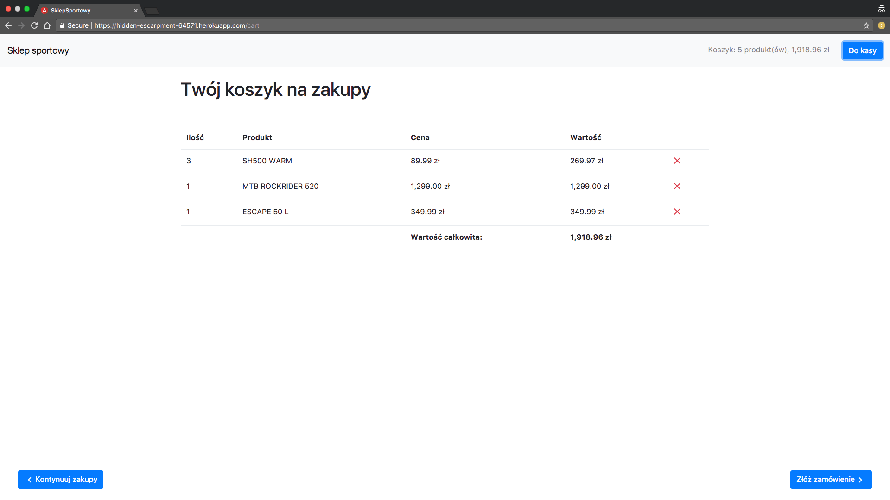

Simple order page finalizes transaction.
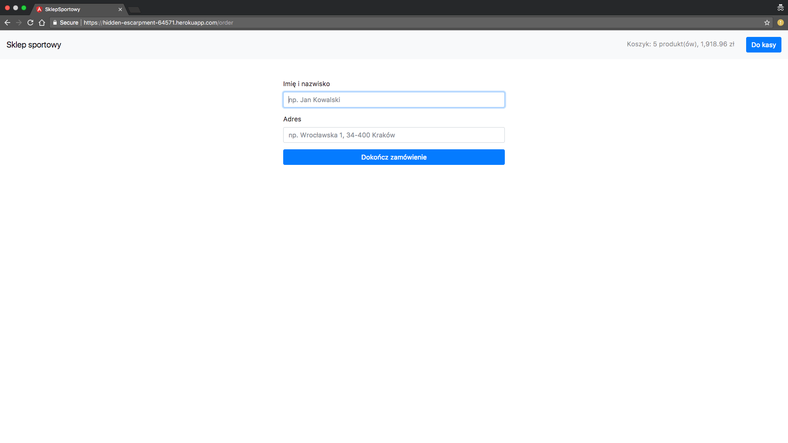

With the help of web-sockets, realtime promotions are available (controlled by admin panel)
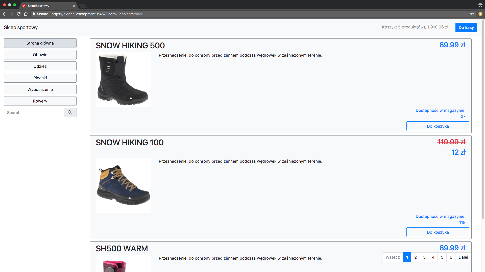

If product that is in your cart changes its availability, you will be informed about it and your cart will be updated (in realtime)
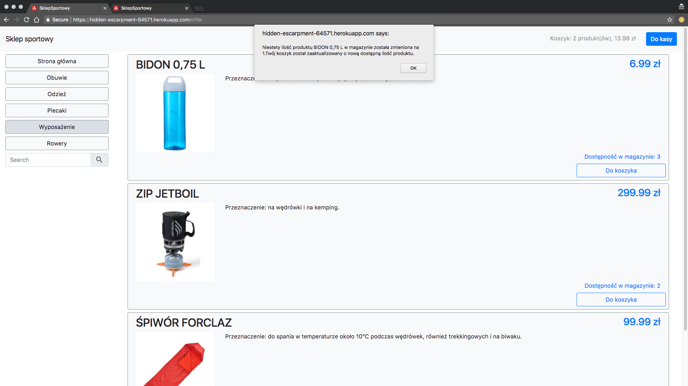
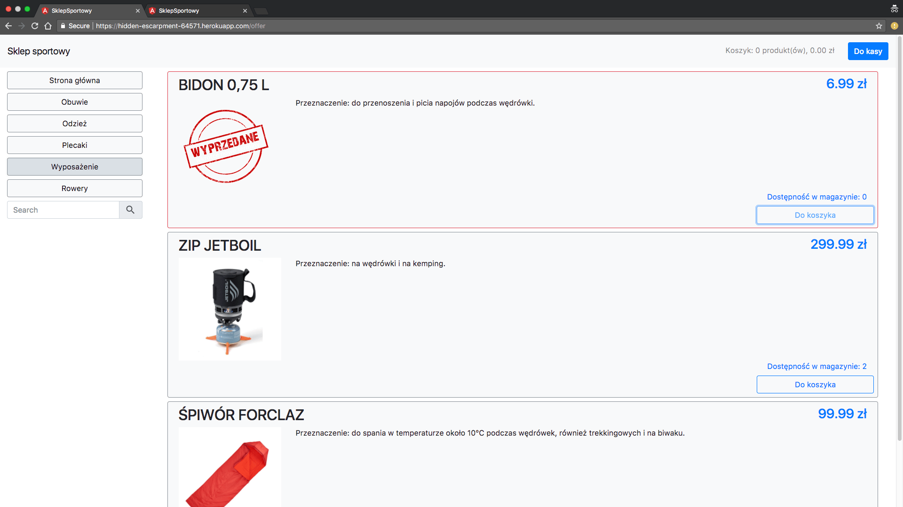
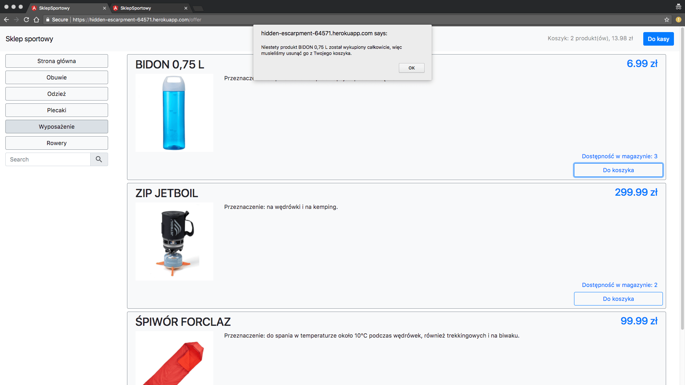


## Administrator panel

Authentication is based on json web token, which is refreshed every time it expires during the user session.
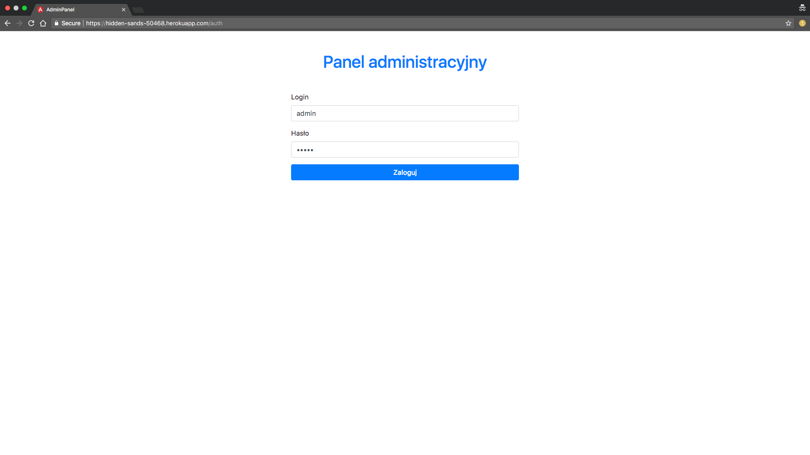
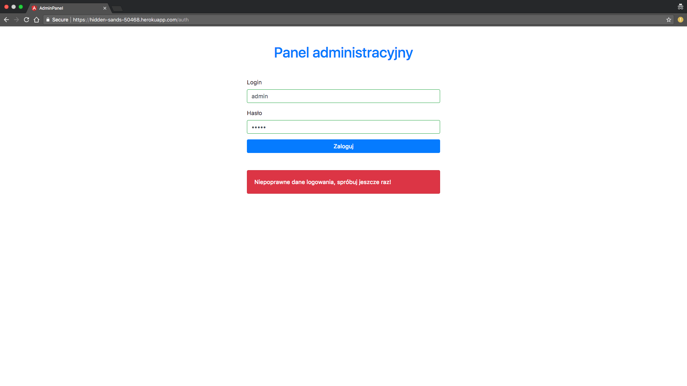
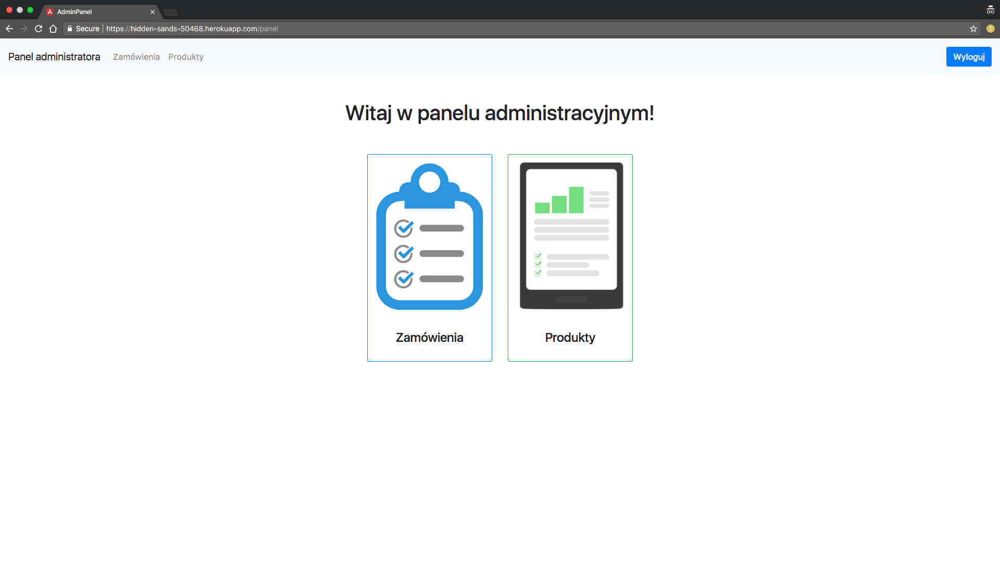

Order list.
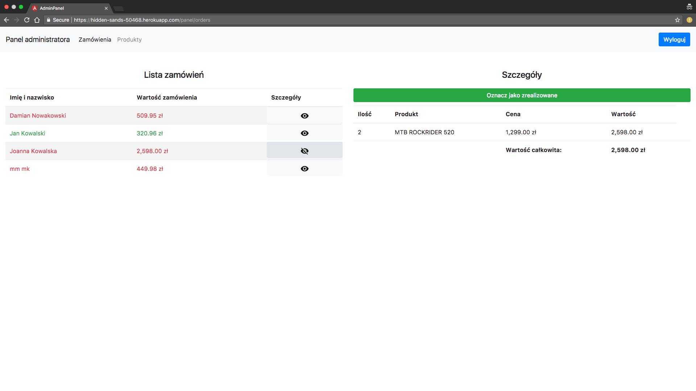
Products list.
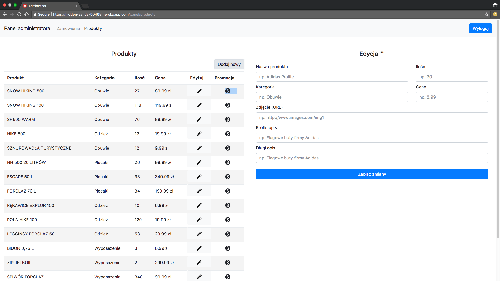
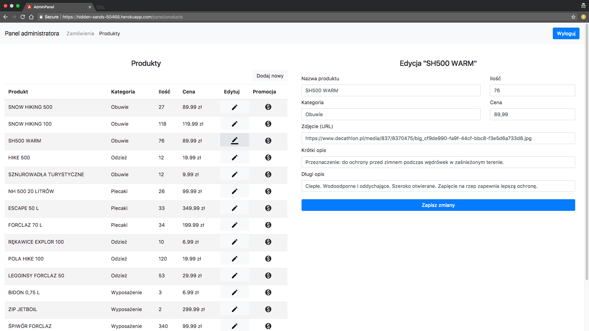
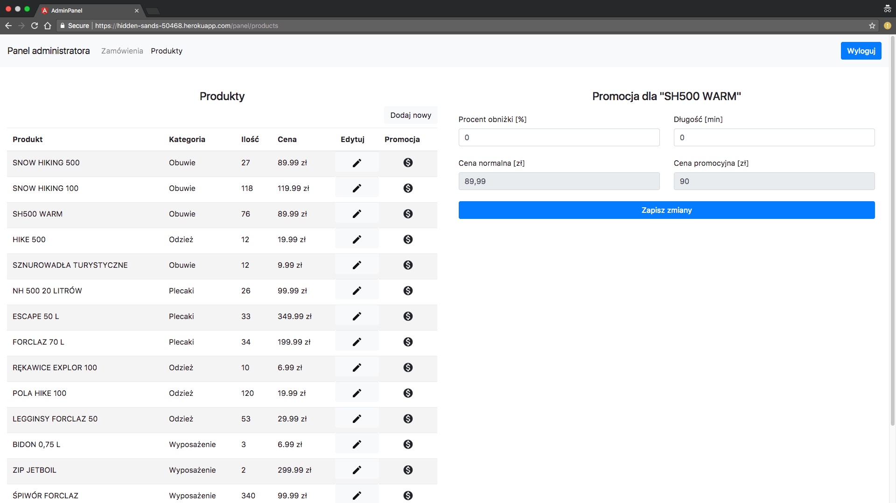


## API server
Node.JS server provides REST API communication. All the data are stored in remote MongoDB server.
API

### Product

Requests:
```
GET /products
POST /products
PUT /products/{id}
```
Model:
```
    {
        "_id": String,
        "quantity": Number,
        "img": String,
        "longDescription": String,
        "description": String,
        "name": String,
        "price": Number,
        "category": {
            "name": String
        }
    }
```

### Promotion

Requests:
```
POST /promotion
```
Model:
```
    {
      "product": Product,
      "discountPerentage": Number,
      "durationMin": Number,
      "active:: Boolean
    }
```

### Categories

Requests:
```
GET /categories
```
Model:
```
    {
        "name": String,
    }
```

### Orders

Requests:
```
GET /orders
POST /orders
PUT /orders/{id}
```
Model:
```
    {
        "_id": String,
        "names": String,
        "address": String,
        "totalAmount": Number,
        "products": [{
            "product": Product,
            "quantity": number,
        },
        ...
        ],
        "done": Boolean,
    }
```

### Users

Requests:
```
POST /users/new
```
Model:
```
    {
        "username": String,
        "password": String,
        "isAdmin": Boolean
    }
```

### Authorization

Requests:
```
POST /users/auth
```
Model:
```
    {
        "username": String,
        "password": String,
    }
```

Response:
```
    {
        "succes": Boolean,
        "token": String,
        "error": String,
    }
```


## Extra information
To clone whole project at once use recursive mode:
```
git clone --recursive git://github.com/thirteendollars/MeanShop.git
```
